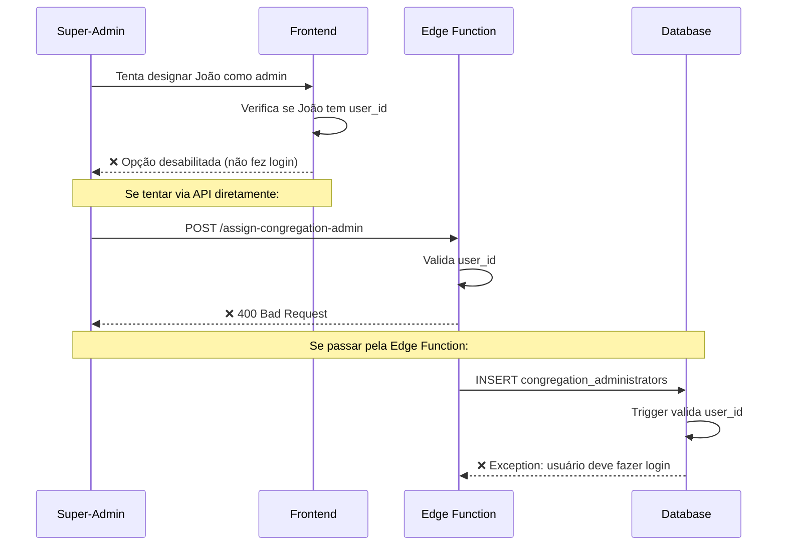
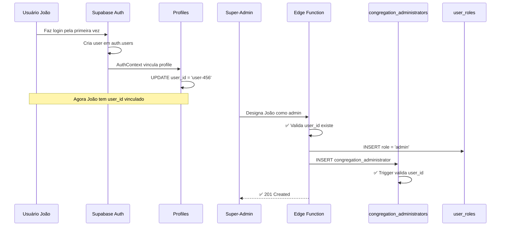

# 🔒 Restrições de Designação de Administradores

## 📋 Resumo

Este documento descreve as restrições implementadas para impedir a designação de administradores antes que os usuários façam login pela primeira vez no sistema.

## 🎯 Problema Resolvido

Anteriormente, era possível designar um usuário como administrador mesmo que ele ainda não tivesse feito login no sistema (profile com `user_id = NULL`). Isso causava problemas porque:

1. A tabela `user_roles` requer um `user_id` válido (chave estrangeira para `auth.users`)
2. Não é possível criar roles para usuários que ainda não existem em `auth.users`
3. Causava inconsistências entre `congregation_administrators` e `user_roles`

## ✅ Solução Implementada

### 1. Constraint no Banco de Dados

**Arquivo**: [`supabase/migrations/20260210000000_add_user_roles_constraints.sql`](supabase/migrations/20260210000000_add_user_roles_constraints.sql)

#### a) Check Constraint em `user_roles`
```sql
ALTER TABLE public.user_roles
  ADD CONSTRAINT user_roles_user_must_exist_check
  CHECK (user_id IS NOT NULL);
```
Garante que apenas `user_id` válidos (não NULL) podem ter roles.

**Nota**: Não é possível usar CHECK constraint com subquery em PostgreSQL, por isso usamos apenas trigger para validar `congregation_administrators`.

#### b) Função de Validação
```sql
CREATE OR REPLACE FUNCTION public.validate_profile_has_user_id()
RETURNS TRIGGER
LANGUAGE plpgsql
AS $$
DECLARE
  profile_user_id UUID;
BEGIN
  SELECT user_id INTO profile_user_id
  FROM public.profiles
  WHERE id = NEW.profile_id;

  IF profile_user_id IS NULL THEN
    RAISE EXCEPTION 'Não é possível designar um administrador para um perfil que ainda não fez login. O usuário deve fazer login pelo menos uma vez antes de ser designado como administrador.';
  END IF;

  RETURN NEW;
END;
$$;
```

#### c) Trigger de Validação
```sql
CREATE TRIGGER validate_profile_linked_before_admin_assignment
  BEFORE INSERT ON public.congregation_administrators
  FOR EACH ROW
  EXECUTE FUNCTION public.validate_profile_has_user_id();
```

### 2. Validação na Edge Function

**Arquivo**: [`supabase/functions/assign-congregation-admin/index.ts`](supabase/functions/assign-congregation-admin/index.ts:71)

```typescript
// CRITICAL: Validate that the profile has a linked user_id
if (!profileData?.user_id) {
  return new Response(
    JSON.stringify({ 
      error: "Não é possível designar um administrador para um perfil que ainda não fez login. O usuário deve fazer login pelo menos uma vez antes de ser designado como administrador.",
      profile_email: profileData?.email,
      profile_name: profileData?.full_name
    }), 
    {
      headers: { "Content-Type": "application/json", ...corsHeaders },
      status: 400,
    }
  );
}
```

**Benefícios**:
- ✅ Validação antes de tentar inserir no banco
- ✅ Mensagem de erro clara e informativa
- ✅ Retorna informações do profile para ajudar o super-admin

### 3. Validação no Frontend

**Arquivo**: [`src/components/congregations/ManageAdminsDialog.tsx`](src/components/congregations/ManageAdminsDialog.tsx:42)

```typescript
// Filtrar betelitas que já fizeram login (têm user_id vinculado)
const availableBetelitas = betelitas?.filter(
  (b) => !admins?.some((a) => a.profile_id === b.id) && b.user_id !== null
);

// Betelitas que ainda não fizeram login
const betelitasWithoutLogin = betelitas?.filter(
  (b) => !admins?.some((a) => a.profile_id === b.id) && b.user_id === null
);
```

**Interface do Usuário**:
- ✅ Betelitas com login aparecem como opções selecionáveis
- ✅ Betelitas sem login aparecem desabilitados com texto "(não fez login ainda)"
- ✅ Seção separada "Aguardando primeiro login" para clareza visual

## 🔄 Fluxo Completo

### Cenário 1: Tentativa de Designar Admin Antes do Login



### Cenário 2: Designação Bem-Sucedida Após Login



## 📊 Tabelas Afetadas

| Tabela | Mudança | Impacto |
|--------|---------|---------|
| [`user_roles`](supabase/migrations/20260129004035_0ce0352c-6d1b-41f0-b53c-cb2f37d29c4b.sql:36) | Check constraint `user_id IS NOT NULL` | Impede inserção de roles sem user_id válido |
| [`congregation_administrators`](supabase/migrations/20260201000006_add_congregation_administrators_table.sql:8) | Check constraint + Trigger | Impede designação de admins sem login |
| [`profiles`](supabase/migrations/20260129004035_0ce0352c-6d1b-41f0-b53c-cb2f37d29c4b.sql:17) | Nenhuma mudança estrutural | Usado para validação de `user_id` |

## 🧪 Como Testar

### Teste 1: Tentar Designar Admin Antes do Login

```sql
-- 1. Criar profile sem user_id
INSERT INTO profiles (full_name, email, congregation_id)
VALUES ('João Silva', 'joao@example.com', '<congregation-id>');

-- 2. Tentar designar como admin (deve falhar)
INSERT INTO congregation_administrators (profile_id, congregation_id)
VALUES ('<profile-id>', '<congregation-id>');

-- Resultado esperado:
-- ERROR: Não é possível designar um administrador para um perfil que ainda não fez login.
```

### Teste 2: Designar Admin Após Login

```sql
-- 1. Simular login (vincular user_id)
UPDATE profiles 
SET user_id = '<user-id-from-auth>'
WHERE email = 'joao@example.com';

-- 2. Designar como admin (deve funcionar)
INSERT INTO congregation_administrators (profile_id, congregation_id)
VALUES ('<profile-id>', '<congregation-id>');

-- Resultado esperado: ✅ Sucesso
```

### Teste 3: Interface do Usuário

1. Como super-admin, acesse "Gerenciar Administradores"
2. Observe que betelitas sem login aparecem desabilitados
3. Tente selecionar um betelita sem login (não deve ser possível)
4. Após o betelita fazer login, ele deve aparecer como opção selecionável

## ⚠️ Considerações Importantes

### 1. Ordem de Operações
```
1. Admin convida usuário → Profile criado (user_id = NULL)
2. Usuário recebe email de convite
3. Usuário faz login → user_id vinculado ao profile
4. Super-admin pode designar como admin → Roles atribuídas
```

### 2. Mensagens de Erro

**No Banco de Dados**:
```
Não é possível designar um administrador para um perfil que ainda não fez login. 
O usuário deve fazer login pelo menos uma vez antes de ser designado como administrador.
```

**Na Edge Function**:
```json
{
  "error": "Não é possível designar um administrador para um perfil que ainda não fez login. O usuário deve fazer login pelo menos uma vez antes de ser designado como administrador.",
  "profile_email": "joao@example.com",
  "profile_name": "João Silva"
}
```

**No Frontend**:
- Opção desabilitada com texto: `João Silva (não fez login ainda)`
- Seção separada: "Aguardando primeiro login"

### 3. Backward Compatibility

Se houver registros existentes em `congregation_administrators` com profiles sem `user_id`, a migration falhará. Para corrigir:

```sql
-- Verificar registros problemáticos
SELECT ca.id, ca.profile_id, p.full_name, p.email, p.user_id
FROM congregation_administrators ca
JOIN profiles p ON p.id = ca.profile_id
WHERE p.user_id IS NULL;

-- Opção 1: Remover designações inválidas
DELETE FROM congregation_administrators
WHERE profile_id IN (
  SELECT id FROM profiles WHERE user_id IS NULL
);

-- Opção 2: Aguardar login dos usuários antes de aplicar migration
```

## 🚀 Aplicando as Mudanças

### 1. Aplicar Migration

```bash
cd c:/src/betel-carpool
supabase db push
```

### 2. Verificar Constraints

```sql
-- Verificar constraint em user_roles
SELECT conname, contype, pg_get_constraintdef(oid)
FROM pg_constraint
WHERE conrelid = 'public.user_roles'::regclass
AND conname = 'user_roles_user_must_exist_check';

-- Verificar constraint em congregation_administrators
SELECT conname, contype, pg_get_constraintdef(oid)
FROM pg_constraint
WHERE conrelid = 'public.congregation_administrators'::regclass
AND conname = 'congregation_administrators_profile_must_be_linked_check';

-- Verificar trigger
SELECT tgname, tgtype, tgenabled
FROM pg_trigger
WHERE tgrelid = 'public.congregation_administrators'::regclass
AND tgname = 'validate_profile_linked_before_admin_assignment';
```

### 3. Deploy Edge Function

```bash
supabase functions deploy assign-congregation-admin
```

### 4. Testar no Frontend

1. Fazer login como super-admin
2. Acessar página de Congregações
3. Clicar em "Gerenciar Admins" em uma congregação
4. Verificar que betelitas sem login aparecem desabilitados

## 📝 Checklist de Implementação

- [x] Criar migration com constraints e triggers
- [x] Atualizar Edge Function com validação
- [x] Atualizar componente frontend com filtros
- [x] Documentar mudanças
- [ ] Aplicar migration no banco de dados
- [ ] Deploy da Edge Function
- [ ] Testar fluxo completo
- [ ] Verificar backward compatibility

## 🐛 Troubleshooting

### Problema: Migration falha ao aplicar

**Causa**: Existem registros em `congregation_administrators` com profiles sem `user_id`

**Solução**:
```sql
-- Listar registros problemáticos
SELECT ca.id, p.full_name, p.email
FROM congregation_administrators ca
JOIN profiles p ON p.id = ca.profile_id
WHERE p.user_id IS NULL;

-- Remover temporariamente
DELETE FROM congregation_administrators
WHERE profile_id IN (
  SELECT id FROM profiles WHERE user_id IS NULL
);

-- Aplicar migration
-- Depois, pedir aos usuários para fazer login
-- E redesignar como admins
```

### Problema: Edge Function retorna erro 400

**Causa**: Tentativa de designar admin para profile sem `user_id`

**Solução**: Aguardar o usuário fazer login antes de designá-lo como admin

### Problema: Betelita não aparece na lista

**Causa**: Betelita ainda não fez login (`user_id = NULL`)

**Solução**: 
1. Verificar se o betelita recebeu o email de convite
2. Pedir para fazer login
3. Após login, ele aparecerá como opção selecionável

## 📞 Suporte

Para mais informações sobre o sistema multi-congregação:
- **Arquitetura**: [ARCHITECTURE_MULTI_CONGREGATION.md](ARCHITECTURE_MULTI_CONGREGATION.md)
- **Implementação**: [IMPLEMENTATION_GUIDE.md](IMPLEMENTATION_GUIDE.md)
- **Resumo**: [MULTI_CONGREGATION_README.md](MULTI_CONGREGATION_README.md)

---

**Última Atualização**: 2026-02-10  
**Versão**: 1.0.0
