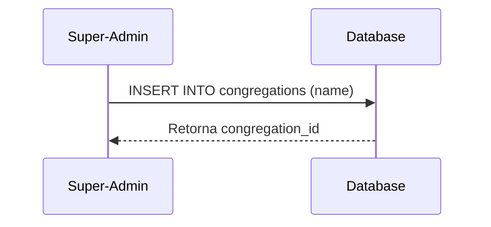
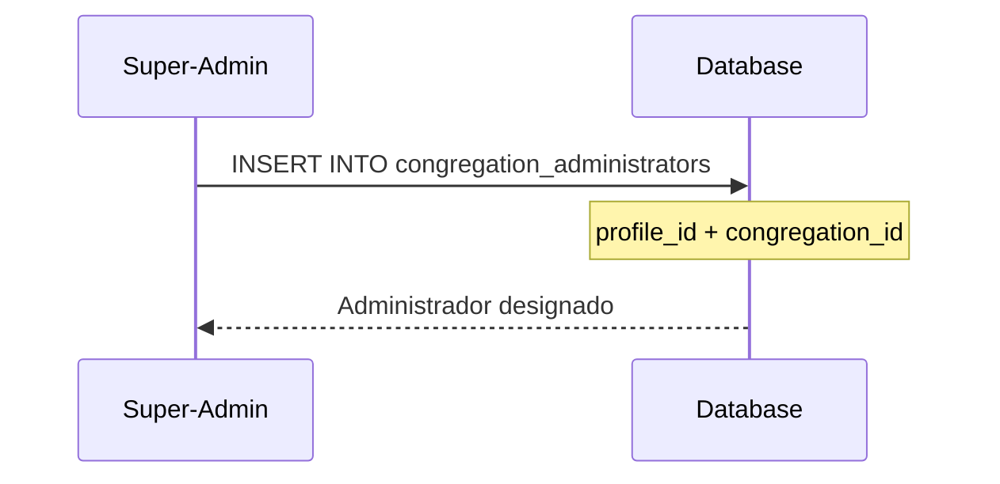
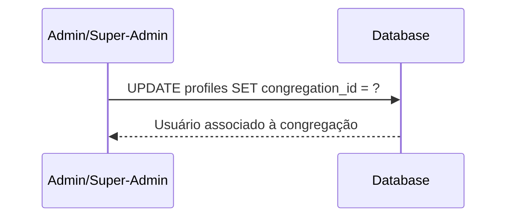
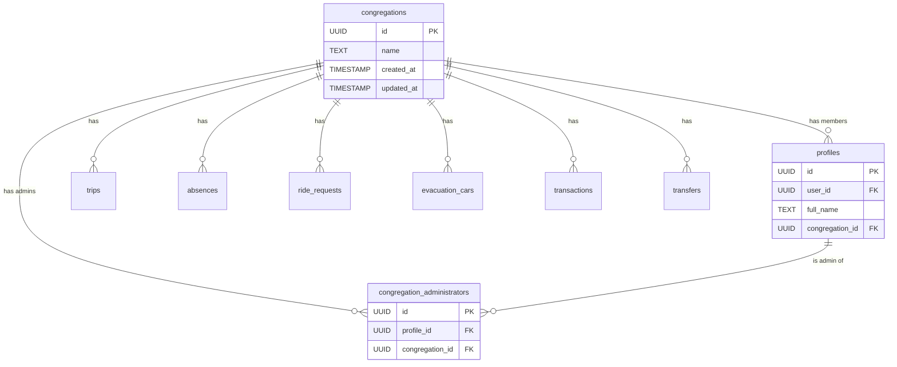

# Arquitetura Multi-Congregação - Sistema de Transporte Betelitas

## Visão Geral

Este documento descreve a arquitetura implementada para suportar múltiplas congregações no sistema de transporte de betelitas. O sistema agora permite que um super-administrador gerencie várias congregações, cada uma com seus próprios administradores e dados isolados.

## Estrutura do Banco de Dados

### Novas Tabelas

#### 1. `congregations`
Armazena informações sobre cada congregação.

| Coluna | Tipo | Descrição |
|--------|------|-----------|
| `id` | UUID | Identificador único (PK) |
| `name` | TEXT | Nome da congregação |
| `created_at` | TIMESTAMP | Data de criação |
| `updated_at` | TIMESTAMP | Data da última atualização |

#### 2. `congregation_administrators`
Liga perfis de usuários às congregações que eles administram.

| Coluna | Tipo | Descrição |
|--------|------|-----------|
| `id` | UUID | Identificador único (PK) |
| `profile_id` | UUID | FK para `profiles.id` |
| `congregation_id` | UUID | FK para `congregations.id` |
| `created_at` | TIMESTAMP | Data de criação |
| `updated_at` | TIMESTAMP | Data da última atualização |

**Constraint:** `UNIQUE (profile_id, congregation_id)` - Um perfil pode ser administrador de uma congregação apenas uma vez.

### Modificações em Tabelas Existentes

#### `profiles`
- **Nova coluna:** `congregation_id` (UUID, FK para `congregations.id`, NULLABLE)
- Será NULL para super-admins e para o perfil "Visitante"

#### Tabelas de Dados
As seguintes tabelas receberam a coluna `congregation_id`:
- `trips`
- `absences`
- `ride_requests`
- `evacuation_cars`
- `transactions`
- `transfers`

## Hierarquia de Permissões

### 1. Super-Administrador (`super_admin`)
- Pode ver e gerenciar todas as congregações
- Pode criar novas congregações
- Pode designar administradores para congregações
- Pode ver todos os dados de todas as congregações
- Não está vinculado a nenhuma congregação específica (`congregation_id` = NULL)

### 2. Administrador de Congregação (`admin`)
- Pode gerenciar dados apenas de sua própria congregação
- Pode gerenciar perfis de usuários de sua congregação
- Pode ver todos os dados de sua congregação
- Está vinculado a uma congregação específica através de `congregation_administrators`

### 3. Usuário Regular (`user`)
- Pode ver apenas dados de sua própria congregação
- Pode gerenciar seus próprios dados (viagens, ausências, etc.)
- Está vinculado a uma congregação através de `profiles.congregation_id`

## Funções Helper

### `get_current_congregation_id()`
Retorna o `congregation_id` do usuário atual.

### `is_super_admin()`
Verifica se o usuário atual é super-administrador.

### `is_congregation_admin(_congregation_id UUID)`
Verifica se o usuário atual é administrador de uma congregação específica.

### `can_access_congregation(_congregation_id UUID)`
Verifica se o usuário pode acessar dados de uma congregação específica.
Retorna `true` se:
- Usuário é super-admin, OU
- Usuário pertence à congregação, OU
- Usuário é administrador da congregação

## Políticas RLS (Row Level Security)

Todas as tabelas de dados foram atualizadas com políticas RLS que:

1. **Super-admins** podem ver e gerenciar todos os dados
2. **Administradores de congregação** podem ver e gerenciar dados de sua congregação
3. **Usuários regulares** podem ver apenas dados de sua congregação

### Exemplo de Política (Trips)

```sql
CREATE POLICY "Trips are viewable by congregation members"
    ON public.trips FOR SELECT
    TO authenticated
    USING (
        public.is_super_admin()
        OR congregation_id = public.get_current_congregation_id()
    );
```

## Fluxo de Trabalho

### 1. Criação de Nova Congregação



### 2. Designação de Administrador



### 3. Associação de Usuário à Congregação



## Migrações Criadas

1. **`20260201000003_add_congregations_table.sql`**
   - Cria tabela `congregations`
   - Adiciona políticas RLS para congregações

2. **`20260201000004_add_super_admin_role.sql`**
   - Adiciona role `super_admin` ao enum `app_role`

3. **`20260201000005_add_congregation_id_to_profiles.sql`**
   - Adiciona coluna `congregation_id` à tabela `profiles`

4. **`20260201000006_add_congregation_administrators_table.sql`**
   - Cria tabela `congregation_administrators`
   - Adiciona políticas RLS

5. **`20260201000007_add_congregation_id_to_data_tables.sql`**
   - Adiciona `congregation_id` a todas as tabelas de dados

6. **`20260201000008_add_congregation_helper_functions.sql`**
   - Cria funções helper para verificação de acesso

7. **`20260201000009_update_rls_policies_for_congregations.sql`**
   - Atualiza todas as políticas RLS para filtrar por congregação

## Próximos Passos

### Backend
- [ ] Criar Edge Functions para operações de super-admin
- [ ] Implementar triggers para auto-associação de dados à congregação do usuário

### Frontend
- [ ] Criar dashboard de super-admin
- [ ] Criar interface para gerenciar congregações
- [ ] Criar interface para designar administradores
- [ ] Atualizar componentes existentes para filtrar por congregação
- [ ] Adicionar seletor de congregação para super-admins

## Considerações de Segurança

1. **Isolamento de Dados:** Cada congregação só pode ver seus próprios dados
2. **Validação de Acesso:** Todas as operações verificam permissões através de RLS
3. **Super-Admin Controlado:** Apenas super-admins podem criar congregações e designar administradores
4. **Auditoria:** Todas as tabelas têm `created_at` e `updated_at` para rastreamento

## Diagrama de Entidade-Relacionamento



## Migração de Dados Existentes

Para migrar dados existentes para o novo sistema:

1. Criar uma congregação padrão
2. Associar todos os perfis existentes a essa congregação
3. Associar todos os dados existentes a essa congregação
4. Designar administradores existentes como administradores da congregação padrão

```sql
-- Exemplo de migração (executar após as migrações principais)
-- 1. Criar congregação padrão
INSERT INTO congregations (name) VALUES ('Congregação Principal')
RETURNING id; -- Guardar este ID

-- 2. Atualizar perfis existentes
UPDATE profiles 
SET congregation_id = '<id-da-congregacao-principal>'
WHERE congregation_id IS NULL 
AND id != '00000000-0000-0000-0000-000000000001'; -- Excluir Visitante

-- 3. Atualizar dados existentes
UPDATE trips SET congregation_id = '<id-da-congregacao-principal>' WHERE congregation_id IS NULL;
UPDATE absences SET congregation_id = '<id-da-congregacao-principal>' WHERE congregation_id IS NULL;
-- ... repetir para outras tabelas
```
