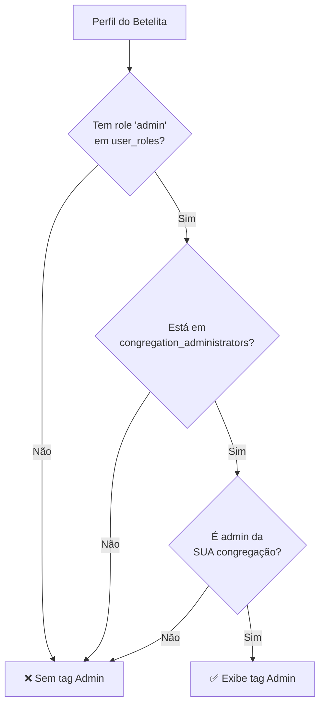

# Corrigir Lógica de Exibição da Tag "Admin"

## Contexto

Atualmente, a tag "Admin" aparece no perfil de um betelita se ele atende a **qualquer uma** destas condições:
- Tem role "admin" ou "super_admin" na tabela `user_roles`
- **OU** está listado na tabela `congregation_administrators`

## Problema

A tag "Admin" deve aparecer apenas quando o betelita atende a **TODAS** estas condições:
1. Tem role "admin" (não "super_admin") na tabela `user_roles`
2. **E** está listado como administrador na tabela `congregation_administrators`
3. **E** é administrador da **sua própria congregação** (não de outra)

## Análise da Lógica Atual

### Arquivo: [`src/hooks/useBetelitas.ts`](src/hooks/useBetelitas.ts:48-92)

```typescript
// Fetch admin user_ids from user_roles
const { data: adminRoles, error: rolesError } = await supabase
  .from("user_roles")
  .select("user_id")
  .in("role", ["admin", "super_admin"]); // ❌ Inclui super_admin

// Fetch congregation administrators (profile-based admin designation)
const { data: congAdmins, error: congAdminsError } = await supabase
  .from("congregation_administrators")
  .select("profile_id"); // ❌ Não filtra por congregation_id

const adminProfileIds = new Set(congAdmins?.map((ca) => ca.profile_id) ?? []);

// Map profiles with admin status
return (profiles ?? []).map((profile) => {
  const userId = profileUserIdMap.get(profile.id);
  const isAdminByRole = userId ? adminUserIds.has(userId) : false;
  const isAdminByCongregation = adminProfileIds.has(profile.id);
  return {
    ...profile,
    is_admin: isAdminByRole || isAdminByCongregation, // ❌ Usa OR em vez de AND
  };
});
```

### Problemas Identificados

1. **Inclui super_admin**: A query busca tanto "admin" quanto "super_admin", mas super_admins não devem ter a tag "Admin" (eles têm privilégios diferentes)

2. **Não verifica a congregação**: A query de `congregation_administrators` não filtra pela congregação do perfil, então um admin de congregação A apareceria com a tag mesmo ao visualizar perfis da congregação B

3. **Usa OR em vez de AND**: A lógica `isAdminByRole || isAdminByCongregation` faz com que a tag apareça se qualquer uma das condições for verdadeira

## Solução Proposta

### Mudanças no Hook useBetelitas

```typescript
// Fetch admin user_ids from user_roles (ONLY 'admin', not 'super_admin')
const { data: adminRoles, error: rolesError } = await supabase
  .from("user_roles")
  .select("user_id")
  .eq("role", "admin"); // ✅ Apenas 'admin'

// Fetch congregation administrators WITH congregation_id
const { data: congAdmins, error: congAdminsError } = await supabase
  .from("congregation_administrators")
  .select("profile_id, congregation_id"); // ✅ Incluir congregation_id

// Create a map of profile_id -> Set of congregation_ids they admin
const adminCongregationsMap = new Map<string, Set<string>>();
(congAdmins ?? []).forEach((ca) => {
  if (!adminCongregationsMap.has(ca.profile_id)) {
    adminCongregationsMap.set(ca.profile_id, new Set());
  }
  adminCongregationsMap.get(ca.profile_id)!.add(ca.congregation_id);
});

// Map profiles with admin status
return (profiles ?? []).map((profile) => {
  const userId = profileUserIdMap.get(profile.id);
  const hasAdminRole = userId ? adminUserIds.has(userId) : false;
  
  // Check if user is admin of THEIR OWN congregation
  const adminCongregations = adminCongregationsMap.get(profile.id);
  const isAdminOfOwnCongregation = 
    profile.congregation_id && 
    adminCongregations?.has(profile.congregation_id);
  
  return {
    ...profile,
    is_admin: hasAdminRole && isAdminOfOwnCongregation, // ✅ Usa AND
  };
});
```

## Casos de Teste

### Cenário 1: Admin Válido
- **Perfil**: João, congregation_id: "cong-a"
- **user_roles**: João tem role "admin"
- **congregation_administrators**: João é admin de "cong-a"
- **Resultado**: ✅ Tag "Admin" aparece

### Cenário 2: Super Admin
- **Perfil**: Maria, congregation_id: "cong-a"
- **user_roles**: Maria tem role "super_admin"
- **congregation_administrators**: Maria é admin de "cong-a"
- **Resultado**: ❌ Tag "Admin" NÃO aparece (super_admin tem tag diferente)

### Cenário 3: Admin de Outra Congregação
- **Perfil**: Pedro, congregation_id: "cong-a"
- **user_roles**: Pedro tem role "admin"
- **congregation_administrators**: Pedro é admin de "cong-b" (não "cong-a")
- **Resultado**: ❌ Tag "Admin" NÃO aparece

### Cenário 4: Apenas Role Admin (sem congregation_administrators)
- **Perfil**: Ana, congregation_id: "cong-a"
- **user_roles**: Ana tem role "admin"
- **congregation_administrators**: Ana NÃO está listada
- **Resultado**: ❌ Tag "Admin" NÃO aparece

### Cenário 5: Apenas congregation_administrators (sem role)
- **Perfil**: Carlos, congregation_id: "cong-a"
- **user_roles**: Carlos NÃO tem role
- **congregation_administrators**: Carlos é admin de "cong-a"
- **Resultado**: ❌ Tag "Admin" NÃO aparece

## Impacto em Outras Partes do Sistema

### AuthContext

O [`AuthContext`](src/contexts/AuthContext.tsx:129) também calcula `isAdmin`:

```typescript
return {
  isAdmin: hasAdminRole || isCongregationAdmin,
  isSuperAdmin: hasSuperAdminRole,
};
```

**Importante**: Este `isAdmin` é usado para **permissões de acesso**, não para exibição de tags. Ele deve continuar usando `OR` porque:
- Um usuário com role "admin" deve ter permissões de admin
- Um usuário listado em `congregation_administrators` deve ter permissões de admin

**Não alterar** a lógica do AuthContext, pois ela serve a um propósito diferente (controle de acesso vs. exibição de informação).

### Componentes Afetados

Os seguintes componentes usam `is_admin` do perfil para **exibição**:
- [`BetelitaRow.tsx`](src/components/betelitas/BetelitaRow.tsx:86-90) - Exibe tag "Admin"
- [`ViewBetelitaDialog.tsx`](src/components/betelitas/ViewBetelitaDialog.tsx:165-166) - Exibe badge "Admin"
- [`BetelitasPage.tsx`](src/pages/BetelitasPage.tsx:105) - Filtro de admins

Todos esses componentes usam o valor `is_admin` retornado por `useBetelitas`, então a mudança será automática.

## Diagrama de Fluxo



## Checklist de Implementação

- [ ] Modificar query de user_roles para buscar apenas role "admin"
- [ ] Modificar query de congregation_administrators para incluir congregation_id
- [ ] Criar Map de profile_id -> Set de congregation_ids
- [ ] Alterar lógica de is_admin para usar AND em vez de OR
- [ ] Verificar que perfil é admin da sua própria congregação
- [ ] Testar cenário 1: Admin válido (deve mostrar tag)
- [ ] Testar cenário 2: Super admin (não deve mostrar tag)
- [ ] Testar cenário 3: Admin de outra congregação (não deve mostrar tag)
- [ ] Testar cenário 4: Apenas role admin (não deve mostrar tag)
- [ ] Testar cenário 5: Apenas congregation_administrators (não deve mostrar tag)
- [ ] Verificar que AuthContext não foi alterado
- [ ] Verificar que filtro de admins funciona corretamente

## Arquivos a Modificar

1. **Modificado**: [`src/hooks/useBetelitas.ts`](src/hooks/useBetelitas.ts)

## Considerações Importantes

### Super Admins

Super admins não devem ter a tag "Admin" porque:
- Eles têm privilégios globais, não específicos de congregação
- A tag "Admin" é para administradores de congregação
- Super admins podem ter uma tag diferente se necessário (ex: "Super Admin")

### Permissões vs. Exibição

É importante distinguir:
- **Permissões** (AuthContext): Usa OR - qualquer condição dá acesso
- **Exibição** (useBetelitas): Usa AND - todas as condições devem ser verdadeiras

Isso garante que:
- Usuários com role "admin" têm permissões mesmo sem estar em congregation_administrators
- Mas a tag só aparece quando ambas as condições são atendidas
