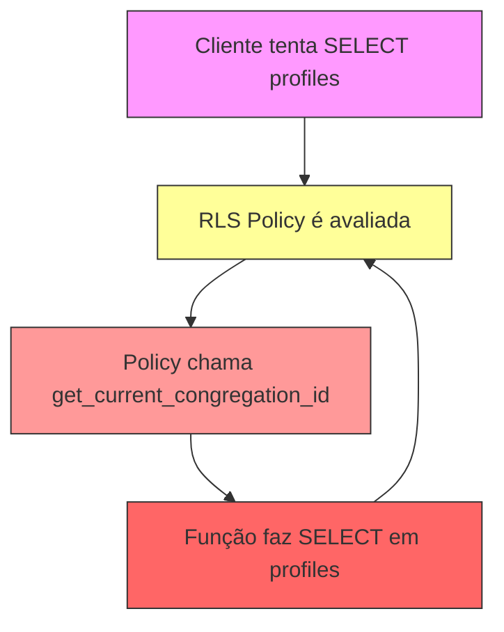
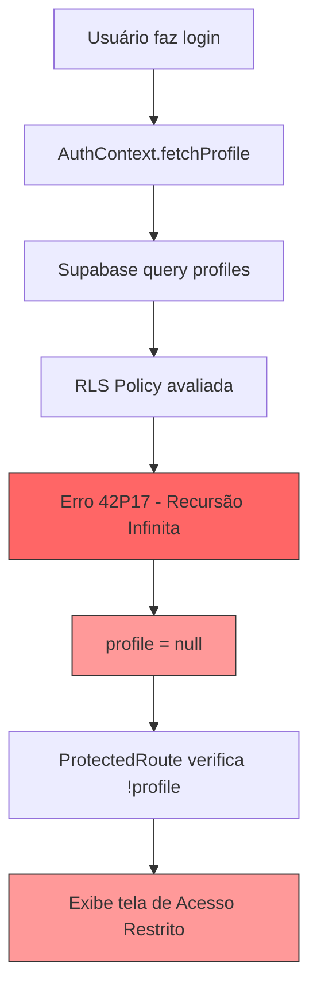

# Análise de Erros e Plano de Solução

## Data: 2026-02-06

## Resumo Executivo

Foram identificados **7 tipos de erros** no console da aplicação, sendo **2 críticos** que impedem o funcionamento correto do sistema:

1. ❌ **CRÍTICO**: Recursão infinita nas políticas RLS da tabela `profiles`
2. ❌ **CRÍTICO**: Tela de acesso restrito sendo exibida para todos os usuários
3. ⚠️ **ALTO**: Erro de domínio do OneSignal
4. ⚠️ **MÉDIO**: Avisos de Permissions Policy deprecadas
5. ⚠️ **BAIXO**: Avisos de React Router sobre flags futuras
6. ⚠️ **BAIXO**: Avisos de React sobre refs em componentes funcionais
7. ⚠️ **BAIXO**: Aviso sobre uso do Tailwind CDN em produção

---

## 1. 🔴 ERRO CRÍTICO: Recursão Infinita nas Políticas RLS

### Problema Identificado

```
Error fetching profile: {
  code: '42P17', 
  details: null, 
  hint: null, 
  message: 'infinite recursion detected in policy for relation "profiles"'
}
```

### Causa Raiz

A função [`get_current_congregation_id()`](supabase/migrations/20260201000008_add_congregation_helper_functions.sql:7) cria uma **dependência circular**:

```sql
CREATE OR REPLACE FUNCTION public.get_current_congregation_id()
RETURNS UUID
LANGUAGE sql
STABLE
SECURITY DEFINER
SET search_path = public
AS $$
    SELECT congregation_id FROM public.profiles WHERE user_id = auth.uid()
$$;
```

**Fluxo da Recursão:**


A política RLS em [`20260203141900_allow_profile_relinking_by_email.sql`](supabase/migrations/20260203141900_allow_profile_relinking_by_email.sql:9) usa essa função:

```sql
CREATE POLICY "Profiles are viewable by authenticated users"
    ON public.profiles FOR SELECT
    TO authenticated
    USING (
        public.is_super_admin()
        OR (public.has_role(auth.uid(), 'admin') AND congregation_id = public.get_current_congregation_id())
        OR congregation_id = public.get_current_congregation_id()  -- ⚠️ RECURSÃO AQUI
        OR user_id = auth.uid()
        OR LOWER(email) = LOWER((SELECT email FROM auth.users WHERE id = auth.uid()))
    );
```

### Solução Proposta

**Opção 1: Usar Subquery Direta (Recomendado)**
```sql
-- Substituir get_current_congregation_id() por subquery inline
OR congregation_id = (
    SELECT p.congregation_id 
    FROM public.profiles p 
    WHERE p.user_id = auth.uid() 
    LIMIT 1
)
```

**Opção 2: Criar Função com Cache de Sessão**
```sql
CREATE OR REPLACE FUNCTION public.get_current_congregation_id()
RETURNS UUID
LANGUAGE plpgsql
STABLE
SECURITY DEFINER
AS $$
DECLARE
    v_congregation_id UUID;
BEGIN
    -- Tentar obter do cache da sessão
    BEGIN
        v_congregation_id := current_setting('app.congregation_id', true)::UUID;
        IF v_congregation_id IS NOT NULL THEN
            RETURN v_congregation_id;
        END IF;
    EXCEPTION WHEN OTHERS THEN
        NULL;
    END;
    
    -- Se não estiver em cache, buscar e cachear
    SELECT congregation_id INTO v_congregation_id
    FROM public.profiles
    WHERE user_id = auth.uid()
    LIMIT 1;
    
    IF v_congregation_id IS NOT NULL THEN
        PERFORM set_config('app.congregation_id', v_congregation_id::TEXT, false);
    END IF;
    
    RETURN v_congregation_id;
END;
$$;
```

**Opção 3: Remover Dependência da Função (Mais Simples)**
```sql
-- Reescrever todas as políticas RLS para não usar get_current_congregation_id()
-- Usar apenas: user_id = auth.uid() e verificações diretas
```

---

## 2. 🔴 ERRO CRÍTICO: Tela de Acesso Restrito para Todos os Usuários

### Problema Identificado

A tela "Acesso Restrito" está sendo exibida mesmo para usuários com perfil e congregação válidos.

### Causa Raiz

O componente [`ProtectedRoute.tsx`](src/components/auth/ProtectedRoute.tsx:31) verifica:

```typescript
if (user && (!profile || !profile.congregation_id)) {
    return <RestrictedAccessScreen />;
}
```

**Problema**: O `profile` está `null` porque:
1. A query em [`AuthContext.tsx`](src/contexts/AuthContext.tsx:44) falha devido ao erro de recursão RLS
2. O erro 500 impede que o perfil seja carregado
3. Sem perfil, a condição `!profile` é verdadeira
4. A tela de acesso restrito é exibida

### Fluxo do Problema



### Solução Proposta

**Passo 1**: Corrigir o erro de recursão RLS (ver solução #1)

**Passo 2**: Adicionar melhor tratamento de erro no [`AuthContext.tsx`](src/contexts/AuthContext.tsx:42):

```typescript
const fetchProfile = async (userId: string) => {
    try {
        const { data: profileData, error: profileError } = await supabase
            .from("profiles")
            .select("*")
            .eq("user_id", userId)
            .maybeSingle();

        if (profileError) {
            // Diferenciar entre erro de permissão e erro de servidor
            if (profileError.code === '42P17') {
                console.error("❌ CRITICAL: RLS recursion error detected");
                // Não definir profile como null imediatamente
                // Tentar novamente após um delay
                setTimeout(() => fetchProfile(userId), 2000);
                return;
            }
            console.error("Error fetching profile:", profileError);
            return;
        }
        
        // ... resto do código
    } catch (error) {
        console.error("Error in fetchProfile:", error);
    }
};
```

**Passo 3**: Adicionar estado de erro no [`ProtectedRoute.tsx`](src/components/auth/ProtectedRoute.tsx:11):

```typescript
export function ProtectedRoute({ children }: ProtectedRouteProps) {
    const { user, profile, isLoading, signOut } = useAuth();
    const [showError, setShowError] = useState(false);
    
    // Adicionar timeout para detectar erro de carregamento
    useEffect(() => {
        if (user && !profile && !isLoading) {
            const timer = setTimeout(() => setShowError(true), 5000);
            return () => clearTimeout(timer);
        }
    }, [user, profile, isLoading]);
    
    // Só mostrar tela de acesso restrito após confirmar que não é erro de carregamento
    if (user && !profile && !isLoading && showError) {
        return <RestrictedAccessScreen />;
    }
    
    // ... resto do código
}
```

---

## 3. ⚠️ ERRO ALTO: OneSignal Domain Restriction

### Problema Identificado

```
Error: Can only be used on: https://betel-carpool.lovable.app
```

### Causa Raiz

O OneSignal está configurado para funcionar apenas no domínio de produção, mas a aplicação está sendo acessada via:
- `https://072eb106-3197-4f9d-94b3-798fdd2a6cf4.lovableproject.com`
- Ou localhost durante desenvolvimento

### Solução Proposta

**Opção 1: Configurar Múltiplos Domínios no OneSignal**
1. Acessar o dashboard do OneSignal
2. Settings → Platforms → Web Push
3. Adicionar domínios permitidos:
   - `https://betel-carpool.lovable.app`
   - `https://*.lovableproject.com`
   - `http://localhost:*` (para desenvolvimento)

**Opção 2: Desabilitar OneSignal em Ambientes Não-Produção**

Modificar [`index.html`](index.html:23):

```html
<script>
  // Só inicializar OneSignal em produção
  if (window.location.hostname === 'betel-carpool.lovable.app') {
    window.OneSignalDeferred = window.OneSignalDeferred || [];
    OneSignalDeferred.push(async function(OneSignal) {
      await OneSignal.init({
        appId: "cb24512d-c95a-4533-a08b-259a5e289e0e",
        safari_web_id: "web.onesignal.auto.0534d2b4-18a9-4e11-8788-4e680cd265b6",
        notifyButton: {
          enable: true,
        },
      });
    });
  }
</script>
```

E modificar [`useOneSignal.ts`](src/hooks/useOneSignal.ts:12):

```typescript
useEffect(() => {
    const initializeOneSignal = async () => {
        // Verificar se estamos em produção
        if (window.location.hostname !== 'betel-carpool.lovable.app') {
            console.log('OneSignal disabled in non-production environment');
            return;
        }
        
        try {
            await oneSignalService.initialize();
            // ... resto do código
        } catch (error) {
            console.error('Error initializing OneSignal:', error);
        }
    };
    
    if (user) {
        initializeOneSignal();
    }
}, [user, profile]);
```

---

## 4. ⚠️ ERRO MÉDIO: Permissions Policy Deprecadas

### Problema Identificado

```
Unrecognized feature: 'vr'
Unrecognized feature: 'ambient-light-sensor'
Unrecognized feature: 'battery'
```

### Causa Raiz

Essas features foram **removidas da especificação Permissions Policy**:
- `vr` → substituída por `xr-spatial-tracking`
- `ambient-light-sensor` → removida
- `battery` → removida (Battery Status API descontinuada)

Provavelmente vêm de um iframe ou script externo (possivelmente Lovable ou OneSignal).

### Solução Proposta

**Não requer ação imediata** - são apenas avisos. Mas para limpar o console:

1. Verificar se há meta tags de Permissions Policy no [`index.html`](index.html:1)
2. Se houver, remover as features deprecadas
3. Se vêm de scripts externos, não há muito o que fazer além de aguardar atualização dos fornecedores

---

## 5. ⚠️ ERRO BAIXO: React Router Deprecation Warnings

### Problema Identificado

```
⚠️ React Router Future Flag Warning: React Router will begin wrapping state updates in `React.startTransition` in v7
⚠️ React Router Future Flag Warning: Relative route resolution within Splat routes is changing in v7
```

### Solução Proposta

Adicionar flags futuras no [`App.tsx`](src/App.tsx:66):

```typescript
<BrowserRouter
  future={{
    v7_startTransition: true,
    v7_relativeSplatPath: true,
  }}
>
  <AuthProvider>
    <CongregationProvider>
      <AppContent />
    </CongregationProvider>
  </AuthProvider>
</BrowserRouter>
```

---

## 6. ⚠️ ERRO BAIXO: React Ref Warnings

### Problema Identificado

```
Warning: Function components cannot be given refs. Attempts to access this ref will fail. 
Did you mean to use React.forwardRef()?
```

### Causa Raiz

Componentes como `QueryClientProvider`, `TooltipProvider`, `BrowserRouter`, etc. estão recebendo refs mas não estão usando `forwardRef`.

### Solução Proposta

**Não requer ação** - esses avisos vêm de bibliotecas externas (React Query, Radix UI, React Router). As bibliotecas já usam `forwardRef` internamente onde necessário. Os avisos são falsos positivos ou serão corrigidos nas próximas versões das bibliotecas.

---

## 7. ⚠️ ERRO BAIXO: Tailwind CDN em Produção

### Problema Identificado

```
cdn.tailwindcss.com should not be used in production
```

### Causa Raiz

Provavelmente há uma tag `<script>` carregando o Tailwind via CDN no HTML.

### Solução Proposta

Verificar [`index.html`](index.html:1) e remover qualquer referência a:
```html
<script src="https://cdn.tailwindcss.com"></script>
```

O projeto já usa Tailwind via PostCSS (ver [`tailwind.config.ts`](tailwind.config.ts:1) e [`postcss.config.js`](postcss.config.js:1)), então o CDN não é necessário.

---

## Plano de Implementação

### Fase 1: Correções Críticas (Prioridade Máxima)

#### 1.1 Corrigir Recursão RLS
- [ ] Criar nova migration para reescrever políticas RLS da tabela `profiles`
- [ ] Remover dependência de `get_current_congregation_id()` nas políticas
- [ ] Usar subqueries diretas ou verificações mais simples
- [ ] Testar políticas RLS com diferentes cenários de usuário

**Arquivo**: `supabase/migrations/20260206000002_fix_profiles_rls_recursion.sql`

```sql
-- Drop políticas existentes
DROP POLICY IF EXISTS "Profiles are viewable by authenticated users" ON public.profiles;
DROP POLICY IF EXISTS "Profiles can be updated by authorized users" ON public.profiles;

-- Criar política SELECT sem recursão
CREATE POLICY "Profiles are viewable by authenticated users"
    ON public.profiles FOR SELECT
    TO authenticated
    USING (
        -- Super admins podem ver todos
        EXISTS (
            SELECT 1 FROM public.user_roles 
            WHERE user_id = auth.uid() 
            AND role = 'super_admin'
        )
        -- Admins podem ver perfis da sua congregação
        OR EXISTS (
            SELECT 1 FROM public.congregation_administrators ca
            JOIN public.profiles p ON p.id = ca.profile_id
            WHERE p.user_id = auth.uid()
            AND ca.congregation_id = profiles.congregation_id
        )
        -- Usuários podem ver perfis da mesma congregação
        OR congregation_id IN (
            SELECT p.congregation_id 
            FROM public.profiles p 
            WHERE p.user_id = auth.uid()
        )
        -- Usuários podem ver seu próprio perfil
        OR user_id = auth.uid()
        -- Usuários podem ver perfis com seu email (para re-linking)
        OR LOWER(email) = LOWER((SELECT email FROM auth.users WHERE id = auth.uid()))
    );

-- Criar política UPDATE sem recursão
CREATE POLICY "Profiles can be updated by authorized users"
    ON public.profiles FOR UPDATE
    TO authenticated
    USING (
        -- Usuários podem atualizar seu próprio perfil
        user_id = auth.uid()
        -- Usuários podem atualizar perfis com seu email (para re-linking)
        OR LOWER(email) = LOWER((SELECT email FROM auth.users WHERE id = auth.uid()))
        -- Super admins podem atualizar todos
        OR EXISTS (
            SELECT 1 FROM public.user_roles 
            WHERE user_id = auth.uid() 
            AND role = 'super_admin'
        )
        -- Admins podem atualizar perfis da sua congregação
        OR EXISTS (
            SELECT 1 FROM public.congregation_administrators ca
            JOIN public.profiles p ON p.id = ca.profile_id
            WHERE p.user_id = auth.uid()
            AND ca.congregation_id = profiles.congregation_id
        )
    )
    WITH CHECK (
        user_id = auth.uid()
        OR LOWER(email) = LOWER((SELECT email FROM auth.users WHERE id = auth.uid()))
        OR EXISTS (
            SELECT 1 FROM public.user_roles 
            WHERE user_id = auth.uid() 
            AND role = 'super_admin'
        )
        OR EXISTS (
            SELECT 1 FROM public.congregation_administrators ca
            JOIN public.profiles p ON p.id = ca.profile_id
            WHERE p.user_id = auth.uid()
            AND ca.congregation_id = profiles.congregation_id
        )
    );
```

#### 1.2 Melhorar Tratamento de Erro no Frontend
- [ ] Adicionar retry logic no `AuthContext.fetchProfile()`
- [ ] Adicionar timeout no `ProtectedRoute` antes de mostrar tela de acesso restrito
- [ ] Adicionar logs mais detalhados para debug

**Arquivo**: `src/contexts/AuthContext.tsx`

### Fase 2: Correções de Alta Prioridade

#### 2.1 Configurar OneSignal para Múltiplos Domínios
- [ ] Atualizar configuração no dashboard do OneSignal
- [ ] Adicionar verificação de ambiente no código
- [ ] Desabilitar OneSignal em desenvolvimento se necessário

**Arquivos**: 
- `index.html`
- `src/hooks/useOneSignal.ts`
- `src/services/oneSignalService.ts`

### Fase 3: Melhorias e Limpeza

#### 3.1 Adicionar Future Flags do React Router
- [ ] Atualizar `BrowserRouter` com flags futuras

**Arquivo**: `src/App.tsx`

#### 3.2 Remover Tailwind CDN
- [ ] Verificar e remover script do CDN do Tailwind

**Arquivo**: `index.html`

---

## Testes Necessários

### Teste 1: Verificar Correção da Recursão RLS
```sql
-- Executar como usuário autenticado
SELECT * FROM profiles WHERE user_id = auth.uid();

-- Deve retornar o perfil sem erro 42P17
```

### Teste 2: Verificar Carregamento de Perfil
1. Fazer login com usuário válido
2. Verificar console do navegador
3. Confirmar que não há erro 500
4. Confirmar que perfil é carregado corretamente
5. Confirmar que dashboard é exibido (não tela de acesso restrito)

### Teste 3: Verificar OneSignal
1. Acessar aplicação no domínio de produção
2. Verificar que OneSignal inicializa sem erros
3. Testar notificações push

### Teste 4: Verificar Avisos do Console
1. Abrir console do navegador
2. Confirmar que avisos críticos foram eliminados
3. Documentar avisos restantes (se houver)

---

## Riscos e Considerações

### Risco 1: Mudança nas Políticas RLS
**Impacto**: Pode afetar permissões de acesso a dados
**Mitigação**: 
- Testar exaustivamente com diferentes tipos de usuário
- Fazer backup do banco antes de aplicar migration
- Ter plano de rollback pronto

### Risco 2: OneSignal em Múltiplos Domínios
**Impacto**: Pode afetar entrega de notificações
**Mitigação**:
- Testar em ambiente de staging primeiro
- Documentar configuração do OneSignal
- Ter plano B (desabilitar temporariamente)

### Risco 3: Breaking Changes do React Router v7
**Impacto**: Pode quebrar navegação quando atualizar
**Mitigação**:
- Adicionar flags futuras agora
- Testar navegação após adicionar flags
- Monitorar changelog do React Router

---

## Conclusão

Os erros identificados variam de **críticos** (que impedem o funcionamento) a **informativos** (que não afetam funcionalidade). A prioridade deve ser:

1. **URGENTE**: Corrigir recursão RLS (bloqueia acesso ao sistema)
2. **ALTA**: Configurar OneSignal corretamente (afeta notificações)
3. **MÉDIA**: Adicionar flags futuras do React Router (preparação para v7)
4. **BAIXA**: Limpar avisos do console (melhoria de qualidade)

**Tempo estimado de implementação**: 
- Fase 1 (Crítico): 2-4 horas
- Fase 2 (Alto): 1-2 horas  
- Fase 3 (Melhorias): 1 hora

**Total**: 4-7 horas de trabalho
