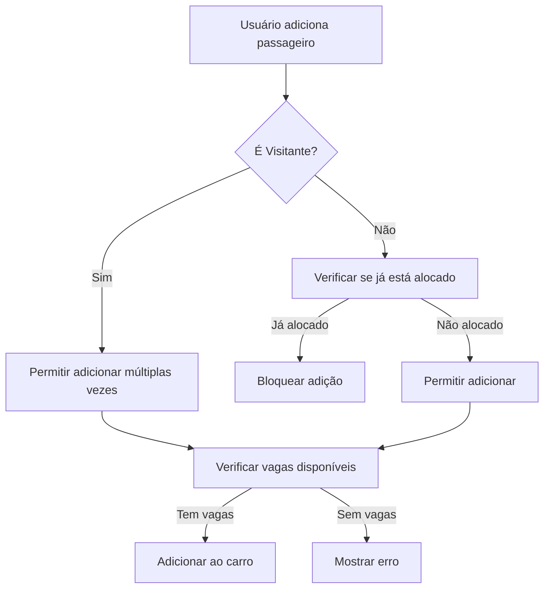

# Permitir Visitante Múltiplas Vezes no Mesmo Carro

## Contexto

O sistema de evacuação atualmente impede que o mesmo passageiro seja adicionado mais de uma vez ao mesmo carro devido a uma constraint `UNIQUE(evacuation_car_id, passenger_id)` na tabela `evacuation_passengers`.

No entanto, existe um perfil especial chamado "Visitante" (UUID: `00000000-0000-0000-0000-000000000001`) que representa visitantes não-regulares. Este perfil deve poder ser adicionado múltiplas vezes ao mesmo carro para representar múltiplos visitantes diferentes.

## Problema Atual

### 1. Constraint de Banco de Dados
**Arquivo**: [`supabase/migrations/20260129004035_0ce0352c-6d1b-41f0-b53c-cb2f37d29c4b.sql`](supabase/migrations/20260129004035_0ce0352c-6d1b-41f0-b53c-cb2f37d29c4b.sql:117)

```sql
CREATE TABLE public.evacuation_passengers (
    id UUID PRIMARY KEY DEFAULT gen_random_uuid(),
    evacuation_car_id UUID REFERENCES public.evacuation_cars(id) ON DELETE CASCADE NOT NULL,
    passenger_id UUID REFERENCES public.profiles(id) ON DELETE CASCADE NOT NULL,
    created_at TIMESTAMP WITH TIME ZONE DEFAULT NOW() NOT NULL,
    UNIQUE(evacuation_car_id, passenger_id)  -- ❌ Esta constraint impede duplicatas
);
```

### 2. Lógica de Filtro no Frontend
**Arquivo**: [`src/hooks/useEvacuation.ts`](src/hooks/useEvacuation.ts:210-214)

```typescript
// Get all passenger IDs already allocated
const allocatedPassengerIds = new Set(
  evacuationQuery.data?.flatMap((car) =>
    car.passengers.map((p) => p.passenger_id)
  ) ?? []
);
```

**Arquivo**: [`src/components/evacuation/AddPassengerPopover.tsx`](src/components/evacuation/AddPassengerPopover.tsx:38-40)

```typescript
// Filter out already allocated people
const availableProfiles = profiles.filter(
  (p) => !allocatedPassengerIds.has(p.id) && !allocatedDriverIds.has(p.id)
);
```

## Solução Proposta

### Arquitetura da Solução



### Mudanças Necessárias

#### 1. Migração de Banco de Dados

**Novo arquivo**: `supabase/migrations/[timestamp]_allow_multiple_visitante_passengers.sql`

```sql
-- ============================================
-- ALLOW MULTIPLE VISITANTE PASSENGERS
-- ============================================
-- Remove the unique constraint that prevents the same passenger
-- from being added multiple times to the same car

-- Drop the existing unique constraint
ALTER TABLE public.evacuation_passengers 
DROP CONSTRAINT IF EXISTS evacuation_passengers_evacuation_car_id_passenger_id_key;

-- Add a new partial unique constraint that allows multiple Visitante entries
-- but still prevents duplicates for regular passengers
CREATE UNIQUE INDEX evacuation_passengers_unique_regular_idx 
ON public.evacuation_passengers (evacuation_car_id, passenger_id)
WHERE passenger_id != '00000000-0000-0000-0000-000000000001'::uuid;

-- Add a comment explaining the constraint
COMMENT ON INDEX evacuation_passengers_unique_regular_idx IS 
'Prevents duplicate passengers in the same car, except for the special Visitante profile which can be added multiple times';
```

**Justificativa**: 
- Remove a constraint UNIQUE global
- Cria um índice UNIQUE parcial que só se aplica a passageiros que NÃO são Visitante
- Permite múltiplas entradas do Visitante no mesmo carro
- Mantém a proteção contra duplicatas para passageiros regulares

#### 2. Atualizar Hook useEvacuation

**Arquivo**: [`src/hooks/useEvacuation.ts`](src/hooks/useEvacuation.ts:209-219)

**Mudança**:
```typescript
// Constante para o UUID do Visitante
const VISITANTE_ID = '00000000-0000-0000-0000-000000000001';

// Get all passenger IDs already allocated (excluding Visitante)
const allocatedPassengerIds = new Set(
  evacuationQuery.data?.flatMap((car) =>
    car.passengers
      .filter((p) => p.passenger_id !== VISITANTE_ID) // ✅ Excluir Visitante
      .map((p) => p.passenger_id)
  ) ?? []
);

// Also include drivers as allocated
const allocatedDriverIds = new Set(
  evacuationQuery.data?.map((car) => car.driver_id) ?? []
);
```

**Justificativa**: 
- Filtra o Visitante do Set de passageiros alocados
- Permite que o Visitante apareça sempre na lista de passageiros disponíveis
- Mantém a lógica de alocação para outros passageiros

#### 3. Adicionar Constante Global (Opcional mas Recomendado)

**Novo arquivo**: `src/constants/profiles.ts`

```typescript
/**
 * UUID do perfil especial "Visitante"
 * Este perfil pode ser usado múltiplas vezes no mesmo carro
 * para representar diferentes visitantes não-regulares
 */
export const VISITANTE_PROFILE_ID = '00000000-0000-0000-0000-000000000001';
```

**Justificativa**:
- Centraliza o UUID do Visitante em um único lugar
- Facilita manutenção futura
- Evita magic strings espalhados pelo código

#### 4. Atualizar Imports no useEvacuation

**Arquivo**: [`src/hooks/useEvacuation.ts`](src/hooks/useEvacuation.ts:1)

```typescript
import { VISITANTE_PROFILE_ID } from "@/constants/profiles";
```

E usar `VISITANTE_PROFILE_ID` em vez da string hardcoded.

### Comportamento Esperado

#### Antes da Mudança
- ❌ Visitante pode ser adicionado apenas uma vez por carro
- ❌ Após adicionar Visitante, ele desaparece da lista de disponíveis
- ✅ Passageiros regulares não podem ser duplicados

#### Depois da Mudança
- ✅ Visitante pode ser adicionado múltiplas vezes ao mesmo carro (respeitando limite de vagas)
- ✅ Visitante permanece sempre disponível na lista de seleção
- ✅ Passageiros regulares continuam não podendo ser duplicados
- ✅ Cada entrada de Visitante é tratada como um visitante diferente

### Exemplo de Uso

```
Carro do João (4 vagas):
├── Passageiro 1: Maria (betelita regular)
├── Passageiro 2: Visitante (visitante 1)
├── Passageiro 3: Visitante (visitante 2)
└── Passageiro 4: Visitante (visitante 3)

Lista de disponíveis:
├── Pedro ✅
├── Ana ✅
├── Visitante ✅ (sempre disponível)
└── Maria ❌ (já está no carro)
```

## Validações e Testes

### Testes Necessários

1. **Teste de Adição Múltipla de Visitante**
   - Adicionar Visitante ao carro
   - Verificar que Visitante ainda aparece na lista
   - Adicionar Visitante novamente
   - Verificar que ambas as entradas existem

2. **Teste de Limite de Vagas**
   - Preencher todas as vagas com Visitantes
   - Verificar que o botão "Adicionar" desaparece quando não há vagas

3. **Teste de Passageiro Regular**
   - Adicionar passageiro regular ao carro
   - Verificar que ele desaparece da lista
   - Tentar adicionar novamente (não deve ser possível)

4. **Teste de Remoção**
   - Adicionar múltiplos Visitantes
   - Remover um Visitante
   - Verificar que apenas aquele foi removido
   - Verificar que outros Visitantes permanecem

### Casos de Borda

1. **Visitante como Motorista**: Visitante não deve poder ser motorista (já está configurado como `is_driver: FALSE`)
2. **Múltiplas Congregações**: Verificar que a funcionalidade funciona corretamente com múltiplas congregações
3. **Notificações Push**: Verificar se notificações funcionam corretamente ao adicionar Visitante

## Impacto em Outras Funcionalidades

### Funcionalidades Afetadas
- ✅ **Plano de Evacuação**: Funcionalidade principal afetada
- ✅ **Listagem de Passageiros**: Mostrará múltiplos "Visitante" no mesmo carro
- ⚠️ **Relatórios**: Pode precisar de ajustes para contar visitantes corretamente

### Funcionalidades NÃO Afetadas
- ✅ **Sistema de Caronas (Trips)**: Usa tabela diferente
- ✅ **Sistema Financeiro**: Visitante já é marcado como `is_exempt: TRUE`
- ✅ **Gestão de Betelitas**: Não relacionado

## Considerações de UX

### Melhorias Futuras (Opcional)
1. **Badge de Contagem**: Mostrar quantos visitantes estão no carro
   ```
   Visitante (3x)
   ```

2. **Diferenciação Visual**: Adicionar ícone ou cor diferente para Visitante
   ```tsx
   {passenger.passenger_name === "Visitante" && (
     <Users className="h-3 w-3 ml-1" />
   )}
   ```

3. **Confirmação ao Remover**: Perguntar qual visitante está sendo removido
   ```
   "Remover um visitante deste carro?"
   ```

## Checklist de Implementação

- [ ] Criar migração SQL para remover constraint UNIQUE
- [ ] Criar nova constraint parcial que exclui Visitante
- [ ] Criar arquivo de constantes com VISITANTE_PROFILE_ID
- [ ] Atualizar hook useEvacuation para filtrar Visitante do Set
- [ ] Atualizar imports para usar constante centralizada
- [ ] Testar adição múltipla de Visitante
- [ ] Testar que passageiros regulares ainda não podem ser duplicados
- [ ] Testar limite de vagas
- [ ] Testar remoção de Visitante específico
- [ ] Verificar notificações push
- [ ] Atualizar documentação se necessário

## Arquivos Modificados

1. **Nova Migração**: `supabase/migrations/[timestamp]_allow_multiple_visitante_passengers.sql`
2. **Novo Arquivo**: `src/constants/profiles.ts`
3. **Modificado**: `src/hooks/useEvacuation.ts`

## Riscos e Mitigações

| Risco | Probabilidade | Impacto | Mitigação |
|-------|---------------|---------|-----------|
| Constraint SQL falhar em produção | Baixa | Alto | Testar em ambiente de staging primeiro |
| Usuários confusos com múltiplos "Visitante" | Média | Baixo | Adicionar tooltip explicativo |
| Performance com muitos visitantes | Baixa | Baixo | Limite de vagas já controla isso |

## Conclusão

Esta solução permite que o perfil "Visitante" seja usado múltiplas vezes no mesmo carro de evacuação, mantendo a integridade dos dados para passageiros regulares. A implementação é simples, focada e não afeta outras partes do sistema.
